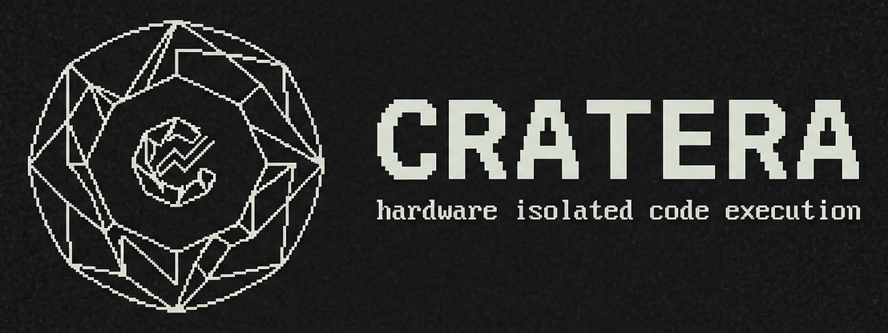

<picture>
  <source media="(prefers-color-scheme: dark)" srcset="docs/images/cratera_logo.png">
  <source media="(prefers-color-scheme: light)" srcset="docs/images/cratera_logo.png">
  
</picture>

[](https://crates.io/crates/cratera)
[](LICENSE)
[](https://www.rust-lang.org)
[](https://firecracker-microvm.github.io)
[](https://cratera.zulipchat.com)
[](https://github.com/sponsors/sundanc)

Hardware-isolated code execution and judge engine written in Rust, powered by Firecracker microVMs.

> **"True hardware microVM isolation instead of shared-kernel container sandboxes. Self-hosted, one Rust binary."**

Each execution runs inside an ephemeral Linux KVM microVM with a read-only rootfs, communicates strictly over `vsock`, and is destroyed immediately after execution.

---

## Table of Contents

- [Why Cratera](#why-cratera)
- [Why Not Containers?](#why-not-containers)
- [Architecture & Workspace Crates](#architecture--workspace-crates)
- [Quick Setup Guide](#quick-setup-guide)
  - [Prerequisites](#prerequisites)
  - [Installation & Quick Start](#installation--quick-start)
- [Interactive Command Center](#interactive-command-center)
  - [1. System Doctor (`cratera doctor`)](#1-system-doctor-cratera-doctor)
  - [2. Multi-Language Manager (`cratera lang`)](#2-multi-language-manager-cratera-lang)
  - [3. Resource Budgets & Limits Editor (`cratera settings`)](#3-resource-budgets--limits-editor-cratera-settings)
  - [4. MicroVM Smoke Tester (`cratera test <lang>`)](#4-microvm-smoke-tester-cratera-test-lang)
  - [5. Persistent Background Coordinator (`cratera serve`)](#5-persistent-background-coordinator-cratera-serve)
- [API Usage & Examples](#api-usage--examples)
  - [1. Request Schema](#1-request-schema)
  - [2. Ready-to-Run Example Script](#2-ready-to-run-example-script)
  - [3. Direct cURL Examples](#3-direct-curl-examples)
  - [JSON Response](#json-response)
- [Verdict Codes](#verdict-codes)
- [Multi-Language Configuration](#multi-language-configuration)
  - [Out-of-the-Box Supported Languages (Top 30)](#out-of-the-box-supported-languages-top-30)
  - [Declarative Recipe Engine](#declarative-recipe-engine)
- [Configuration Reference](#configuration-reference)
- [Systemd Service & Deployment](#systemd-service--deployment)
  - [Systemd Directives & Environment Breakdown](#systemd-directives--environment-breakdown)
  - [One-Command Activation](#one-command-activation)
  - [Managing the Service via Cratera CLI & Command Center](#managing-the-service-via-cratera-cli--command-center)
  - [Direct Systemctl Commands](#direct-systemctl-commands)
- [Recommended Ingress: Cloudflare Zero Trust & Private Networks](#recommended-ingress-cloudflare-zero-trust--private-networks)
- [Development & Verification](#development--verification)
- [Troubleshooting & FAQ](#troubleshooting--faq)
- [Community & Discussion](#community--discussion)
- [Governance & Security](#governance--security)
- [License](#license)

---

## Why Cratera

- Untrusted code, macro expansions, and system calls are isolated from the host kernel by a hardware virtualization boundary (Intel VT-x / AMD-V), not shared namespaces or cgroups. Guest syscalls terminate entirely inside the guest kernel, never reaching the host.
- Boots clean microVMs in milliseconds or restores from snapshots.
- MicroVMs have zero network devices attached. Host coordinator enforces systemd eBPF sandboxing (`IPAddressDeny=any`) to block all non-localhost inbound and outbound traffic.
- Measures in-guest user execution in microseconds ($\mu s$) and tracks anonymous RSS (`RssAnon`), filtering out shared library noise.
- Integrates with Firecracker Jailer for dropped UID/GID (`20001`), chroot, cgroups v2, and isolated PID namespaces.

---

## Why Not Containers?

The dominant open-source code execution judges — **Judge0**, **Piston** like self-hosted runners — rely on Linux containers (Docker + `isolate`, Docker `--privileged`, or managed cgroups). The shared-kernel model has a documented, public track record of full-host compromise from within sandboxed code:

| Judge / Engine | Isolation Model | Notable CVEs / Issues |
| :--- | :--- | :--- |
| **Judge0** | Docker + `isolate` binary (shared kernel) | [CVE-2024-28189](https://nvd.nist.gov/vuln/detail/CVE-2024-28189) (CVSS **10.0**) — symlink attack → host file overwrite → RCE outside sandbox; [CVE-2024-28185](https://nvd.nist.gov/vuln/detail/CVE-2024-28185), [CVE-2024-29021](https://nvd.nist.gov/vuln/detail/CVE-2024-29021) — privileged container escape and SSRF chaining to full host root. Disclosed April 2024. |
| **Piston** | Docker containers (shared kernel) | Relies on Docker isolation; inherits shared-kernel namespace escape risk. No dedicated security model document. |
| **Cratera** | Firecracker KVM microVMs (hardware boundary) | Guest code interacts only with the guest Linux kernel. No shared namespaces. No privileged containers. See [docs/threat_model.md](docs/threat_model.md) for full analysis. |

The root cause in every container-based escape is the same: the attacker's code and the host OS share a single Linux kernel. A single namespace misconfiguration, privileged flag, or kernel LPE turns a "sandboxed" job into full host access.

Firecracker microVMs eliminate the shared-kernel surface entirely. Guest syscalls are trapped by KVM's hardware boundary, not by namespace filtering. A guest kernel panic or root-level exploit inside the VM does not propagate to the host. This structural difference is why Cratera uses microVMs rather than containers, and why it is self-hosted by design — you control the hypervisor, the host kernel patch level, and the entire stack.

---

## Architecture & Workspace Crates

Cratera is organized as a clean, modular Rust Cargo workspace:

| Crate | Crates.io | Description |
| :--- | :--- | :--- |
| **[`cratera`](crates/api)** | [](https://crates.io/crates/cratera) | CLI binary, Command Center TUI, and HTTP Axum coordinator daemon (`POST /harness`). |
| **[`cratera-executor`](crates/executor)** | [](https://crates.io/crates/cratera-executor) | Firecracker microVM lifecycle, Jailer boundary, and ~5ms snapshot restore engine. |
| **[`cratera-compiler`](crates/compiler)** | [](https://crates.io/crates/cratera-compiler) | Multi-language harness splicing and code validator. |
| **[`cratera-common`](crates/common)** | [](https://crates.io/crates/cratera-common) | Shared protocol types, verdicts, and serialization models. |
| **[`cratera-guest-agent`](crates/guest-agent)** | [](https://crates.io/crates/cratera-guest-agent) | In-guest vsock telemetry, process supervision, and execution runner. |

```
┌─────────────────────────────────────────────────────────────┐
│                 HTTP Client / Web Gateway                   │
└──────────────────────────────┬──────────────────────────────┘
                               │ POST /harness (Bearer Token)
                               ▼
┌─────────────────────────────────────────────────────────────┐
│                 Cratera Host Coordinator                    │
│   • Bearer Token Auth         • Fast Snapshot Restore (~5ms)│
│   • Template Splicing         • Firecracker Jailer (20001)  │
└──────────────────────────────┬──────────────────────────────┘
                               │
                vsock:52 (IPC) │  Zero-NIC KVM Hardware Boundary
                               ▼
┌─────────────────────────────────────────────────────────────┐
│         Firecracker MicroVM (2 vCPU, 2 GiB RAM)             │
│                                                             │
│   ┌─────────────────────────────────────────────────────┐   │
│   │  cratera-agent (PID 1)                              │   │
│   │    ├── Vsock Server (Port 52)                       │   │
│   │    ├── Compile / Interpret (tmpfs, 12s budget)      │   │
│   │    └── Execute & Measure (Microsecond / RssAnon)    │   │
│   └─────────────────────────────────────────────────────┘   │
│                                                             │
│   Storage: Read-Only SquashFS / ext4   │  RAM: 256MB tmpfs  │
└──────────────────────────────┬──────────────────────────────┘
                               │
                               │ JSON Verdict over Vsock
                               ▼
┌─────────────────────────────────────────────────────────────┐
│                    Reap & Destroy MicroVM                   │
│      • Wipe Jail Directory        • Release cgroups v2      │
└─────────────────────────────────────────────────────────────┘
```

---

## Quick Setup Guide

### Prerequisites

- **Linux with KVM** (Fedora, Ubuntu, Debian, Arch, RHEL) with `/dev/kvm` hardware virtualization.
- **Container Engine** (Docker or rootless Podman) to assemble the guest rootfs.
- **Rust Toolchain** (`cargo` and `rustc` 1.80+).

### Installation & Quick Start

```bash
# Option A: Install binary directly via Cargo from Crates.io
cargo install cratera

# Option B: Clone & run the automated interactive setup
git clone https://github.com/cratera-project/cratera.git
cd cratera
./scripts/install.sh
```

---

## Interactive Command Center

Launch the terminal control center from anywhere by typing `cratera` (or `./target/release/cratera` locally):

```
╭─────────────────────────────────────────────────────────────╮
│             CRATERA INTERACTIVE COMMAND CENTER              │
│     Hardware MicroVM Isolation & Multi-Language Sandbox     │
│           Systemd: ● Service Active & Supervised            │
╰─────────────────────────────────────────────────────────────╯

  [1] System Diagnostics & Health Check (/dev/kvm, Jailer, storage, kernel)
  [2] Multi-Language Toolchains Manager (Toggle 30 languages, apply presets)
  [3] Resource Budgets & Limits Editor (vCPU, RAM, cgroups, timeouts)
  [4] In-Guest MicroVM Smoke Tester (Measure microsecond execution)
  [5] Build / Rebuild Guest Rootfs Image (SquashFS / ext4)
  [6] Start / Stop Local Dev Server [Active on 127.0.0.1:3100]
  [7] Systemd Service Manager [Active & Running]
  [0] Exit Command Center
```

### Key Subsystems:

#### 1. System Doctor (`cratera doctor`)
Non-destructive 5-step diagnostic suite for `/dev/kvm` permissions, SMT hyperthreading status, Jailer UID 20001, Linux cgroups v2, guest kernel, and SquashFS rootfs validation.

#### 2. Multi-Language Manager (`cratera lang`)
* **Interactive Cursor Checklist**: Launch `cratera lang` to navigate the 30-language table with `↑` / `↓` (or `j` / `k`) and toggle compilers on/off instantly with `Enter` or `Space`.
* **Dynamic Viewport**: Supports scrollable viewports on compact terminal windows.
* **Curated Presets**: Quick switch between `all`, `top10`, `systems`, `web`, `functional`, `scientific`, and `minimal` (Rust only).
* **CLI & Numeric Indexing**: Toggle by table number (`cratera lang disable 27 28`) or language key (`cratera lang enable go zig`).

#### 3. Resource Budgets & Limits Editor (`cratera settings`)
Interactive editor for per-VM hardware allocation (vCPUs, RAM MiB), execution timeouts, and Jailer cgroup limits with `.env` persistence.

#### 4. MicroVM Smoke Tester (`cratera test [lang]`)
Boots real isolated microVMs over KVM and reports boot latency ($ms$), compiler time ($ms$), and execution time ($\mu s$) with anonymous RSS profiling.

#### 5. Persistent Background Coordinator (`cratera serve`)
* Starts the Axum HTTP coordinator on `127.0.0.1:3100` as a detached daemon process with PID tracking.
* **Closing the Command Center leaves the server running** so external clients and test scripts can continue submitting workloads.
* Select `[6]` anytime from the Command Center to gracefully stop the background daemon.

---

## API Usage & Examples

### 1. Request Schema

Execute untrusted code inside an ephemeral microVM by sending `POST /harness`:

| Parameter | Type | Required | Default | Description |
| :--- | :--- | :---: | :--- | :--- |
| `language` | string | Optional | `rust` | Target language key defined in [`languages.toml`](languages.toml) (e.g. `python`, `node`, `rust`, `cpp`, `go`, `zig`). |
| `code` | string | **Yes** | — | Source code to execute in the guest. |
| `mode` | string | Optional | `"run"` | Execution mode: `"run"` (2-second budget) or `"submit"` (5-second budget). |
| `harness` | string | Optional | `""` | Optional harness template for competitive judging or test assertions. |

---

### 2. Ready-to-Run Example Script

Cratera includes [`examples/submit.sh`](examples/submit.sh) to quickly submit code in any language:

```bash
# Execute Python 3
./examples/submit.sh python

# Execute JavaScript / Node
./examples/submit.sh node

# Execute Rust
./examples/submit.sh rust

# Execute C++20
./examples/submit.sh cpp
```

---

### 3. Direct cURL Examples

```bash
# Execute Rust (2024 Edition)
curl -s -X POST http://127.0.0.1:3100/harness \
  -H "Authorization: Bearer <your-api-key>" \
  -H "Content-Type: application/json" \
  -d '{
    "language": "rust",
    "code": "fn main() { println!(\"Hello from isolated microVM!\"); }",
    "mode": "submit"
  }'
```

```bash
# Execute Python 3
curl -s -X POST http://127.0.0.1:3100/harness \
  -H "Authorization: Bearer <your-api-key>" \
  -H "Content-Type: application/json" \
  -d '{
    "language": "python",
    "code": "x = sum([1, 2, 3, 4])\nprint(f\"Result: {x}\")",
    "mode": "submit"
  }'
```

### JSON Response

```json
{
  "compilationSuccess": true,
  "passed": true,
  "status": "Passed",
  "verdict": "AC",
  "stdout": "Hello from isolated microVM!\n",
  "executionTime": 124,
  "memoryKb": 192,
  "compileMs": 384,
  "bootMs": 45,
  "wallMs": 510,
  "restored": true
}
```

---

## Verdict Codes

| Verdict | Status | Description |
| :--- | :--- | :--- |
| `AC` | Passed | Solution passed all test assertions (exit code 0). |
| `WA` | Test Failed | Assertion failed (`assert!` panic). |
| `CE` | Compilation Error | Compilation failed. |
| `TLE` | Time Limit Exceeded | Execution exceeded runtime timeout. |
| `MLE` | Memory Limit Exceeded | Process exceeded memory budget. |
| `RE` | Runtime Error | Process crashed or exited with non-zero status. |
| `IE` | Internal Error | Infrastructure or sandbox initialization failure. |

---

## Multi-Language Configuration

All 30 runtimes, compilers, and packages are defined declaratively in [`languages.toml`](languages.toml).

### Out-of-the-Box Supported Languages (Top 30):
* **Systems & Low-Level**: Rust (2024), C (C17/GCC 14), C++ (C++20), Go (1.24), Zig (0.14), Nim, D (DMD), Fortran (GFortran).
* **General & Scripting**: Python 3.12, JavaScript (Node.js 24), TypeScript (esbuild + Node), Ruby (3.3), PHP (8.3), Lua, Perl.
* **Enterprise & JVM**: Java (OpenJDK 21), C# (Mono), F# (.NET/Mono), Scala 3 (3.6), Kotlin (2.1), Clojure.
* **Functional & Scientific**: Julia (1.11), Haskell (GHC 9.6), OCaml (5.1), Elixir, Erlang.
* **Mobile & Modern**: Swift (6.0), Dart, R, Bash.

### Declarative Recipe Engine
Each language in [`languages.toml`](languages.toml) uses one of four explicit install strategies:
* `install = "curl_tar"`: Direct download and extraction of official standalone releases (e.g. Zig, Scala 3, Julia).
* `install = "docker_image"`: Extracts compiler binaries directly from official Docker/OCI images (e.g. Rust, Swift, Dart).
* `install = "apt_core"`: Installs optimized packages from Ubuntu 24.04 repositories.
* `install = "docker_image_base"`: Sets the base container image.

To add, toggle, or update any language:
1. Edit [`languages.toml`](languages.toml) or run `cratera lang` to toggle interactively.
2. Run `./scripts/build-rootfs.sh` (or `cratera build`) to update the guest rootfs and verify in-guest execution.

See [docs/languages.md](docs/languages.md) for full recipe syntax and examples.

---

## Configuration Reference

Set in `.env` or manage directly via `cratera settings`:

| Variable | Default | Description |
| :--- | :--- | :--- |
| `CRATERA_BIND` | `127.0.0.1:3100` | Host API bind address. |
| `CRATERA_INTERNAL_KEY` | (auto-generated) | Shared secret for Bearer authentication. |
| `CRATERA_RUN_MS` | `2000` | Execution time limit for test runs (ms). |
| `CRATERA_SUBMIT_MS` | `5000` | Execution time limit for formal submissions (ms). |
| `CRATERA_MAX_TIME_MS` | `10000` | Hard upper ceiling for execution timeouts (ms). |
| `CRATERA_COMPILE_TIMEOUT_SECS` | `12` | Guest compiler compilation budget (seconds). |
| `CRATERA_VCPU` | `2` | Virtual CPU cores allocated per MicroVM. |
| `CRATERA_MEM_MIB` | `2048` | Guest RAM memory allocated per MicroVM (MiB). |
| `CRATERA_JAIL_MEM_MAX` | `3221225472` | Host cgroup memory.max per Firecracker process (bytes). |
| `CRATERA_JAIL_PIDS_MAX` | `64` | Host cgroup pids.max process limit per MicroVM. |
| `CRATERA_FIRECRACKER` | `./images/firecracker` | Path to Firecracker binary. |
| `CRATERA_JAILER` | `./images/jailer` | Path to Jailer binary. |
| `CRATERA_KERNEL` | `./images/vmlinux.bin` | Path to guest kernel. |
| `CRATERA_ROOTFS` | `./images/rootfs.squashfs` | Path to guest SquashFS / ext4 rootfs disk image. |
| `CRATERA_WORK_DIR` | `/var/tmp/cratera` | Directory for ephemeral VM roots. |
| `CRATERA_USE_JAILER` | `0` | Set `1` to enable Firecracker Jailer isolation. |
| `CRATERA_JAIL_UID` | `20001` | UID for unprivileged jailer process. |
| `CRATERA_JAIL_GID` | `20001` | GID for unprivileged jailer process. |
| `CRATERA_USE_SNAPSHOT` | `0` | Set `1` to enable fast snapshot restore. |
| `CRATERA_SNAPSHOT_DIR`| `./images/snapshot` | Directory for golden snapshot files. |

---

## Systemd Service & Deployment

Cratera includes a systemd unit at [`deploy/cratera.service`](deploy/cratera.service). The unit provides verified default settings for unattended background execution across modern Linux distributions (Ubuntu, Debian, Fedora, Arch, RHEL).

> - Host-level eBPF network sandboxing (`IPAddressDeny=any`), cgroups v2 resource delegation (`Delegate=yes`), and unprivileged Jailer isolation (UID/GID `20001`) are enabled out of the box.
> - All paths are self-contained in `/opt/cratera`. Custom ports, memory ceilings, and authentication keys can be set in `/opt/cratera/.env` without modifying the unit file.

```ini
[Unit]
Description=Cratera Firecracker harness judge service
After=network.target

[Service]
Type=simple
User=root
WorkingDirectory=/opt/cratera
Environment=NODE_ENV=production
Environment=CRATERA_BIND=127.0.0.1:3100
Environment=CRATERA_FIRECRACKER=/usr/local/bin/firecracker
Environment=CRATERA_JAILER=/usr/local/bin/jailer
Environment=CRATERA_KERNEL=/opt/cratera/images/vmlinux.bin
Environment=CRATERA_ROOTFS=/opt/cratera/images/rootfs.ext4
Environment=CRATERA_WORK_DIR=/var/lib/cratera
Environment=CRATERA_USE_JAILER=1
Environment=CRATERA_JAIL_UID=20001
Environment=CRATERA_JAIL_GID=20001
Environment=CRATERA_USE_SNAPSHOT=1
Environment=CRATERA_SNAPSHOT_DIR=/opt/cratera/images/snapshot
EnvironmentFile=-/opt/cratera/.env
ExecStart=/opt/cratera/cratera
Restart=on-failure
RestartSec=3
LimitNOFILE=65536
Delegate=yes
KillMode=mixed

IPAddressDeny=any
IPAddressAllow=localhost

[Install]
WantedBy=multi-user.target
```

### Systemd Directives & Environment Breakdown

| Section | Directive / Variable | Configured Value | Architectural Purpose & Security Function |
| :--- | :--- | :--- | :--- |
| **`[Unit]`** | `Description` | `Cratera Firecracker harness judge service` | Identifies the judge daemon in system logs (`journalctl -u cratera`) and process supervisors. |
| **`[Unit]`** | `After` | `network.target` | Delays daemon execution until basic host network stack and loopback interface are initialized. |
| **`[Service]`** | `Type` | `simple` | Treats the service as active immediately upon launching the `ExecStart` process. |
| **`[Service]`** | `User` | `root` | Required on the host to open `/dev/kvm` ioctls, manage rootfs loop mounts, and spawn Firecracker Jailer (which drops unprivileged child permissions to UID/GID `20001`). |
| **`[Service]`** | `WorkingDirectory` | `/opt/cratera` | Sets root execution context for resolving relative configuration files (`languages.toml`, `images/`). |
| **`[Service]`** | `ExecStart` | `/opt/cratera/cratera` | Absolute binary path to the Cratera CLI and HTTP Coordinator daemon (`cratera serve`). |
| **`[Service]`** | `EnvironmentFile` | `-/opt/cratera/.env` | Loads optional operator environment overrides. The leading `-` prevents service failure if `.env` is absent. |
| **`[Service]`** | `Restart` | `on-failure` | Automatically resurrects the service if the coordinator process terminates unexpectedly or crashes. |
| **`[Service]`** | `RestartSec` | `3` | Imposes a 3-second delay before restarting to prevent rapid restart loops during hardware faults. |
| **`[Service]`** | `LimitNOFILE` | `65536` | Raises file descriptor limits to accommodate high-concurrency microVM execution (epoll pipes, vsock descriptors, disk handles). |
| **`[Service]`** | `Delegate` | `yes` | **Critical for cgroups v2**: Grants Cratera authority over its own cgroup sub-hierarchy (`/sys/fs/cgroup/system.slice/cratera.service/...`) to enforce per-microVM CPU and memory budgets. |
| **`[Service]`** | `KillMode` | `mixed` | Sends `SIGTERM` to the main coordinator process on stop/restart, then sends `SIGKILL` to any lingering microVM child processes. |
| **`[Service]`** | `IPAddressDeny` | `any` | **Host-level eBPF Sandboxing**: Employs kernel eBPF cgroup network filters to drop all inbound and outbound IPv4/IPv6 packets. |
| **`[Service]`** | `IPAddressAllow` | `localhost` | Whitelists loopback traffic (`127.0.0.1`, `::1`), allowing local API clients and reverse proxies (e.g. Nginx, Caddy) to submit evaluation jobs while preventing external internet egress. |
| **`[Service]`** | `NODE_ENV` | `production` | Sets standard production environment flag for Node runtime wrappers. |
| **`[Service]`** | `CRATERA_BIND` | `127.0.0.1:3100` | Host HTTP API bind socket. Restricting to `127.0.0.1` ensures only authenticated local applications can access the judge. |
| **`[Service]`** | `CRATERA_FIRECRACKER`| `/usr/local/bin/firecracker` | Path to the installed AWS Firecracker VMM binary. |
| **`[Service]`** | `CRATERA_JAILER` | `/usr/local/bin/jailer` | Path to the unprivileged Firecracker Jailer wrapper binary. |
| **`[Service]`** | `CRATERA_KERNEL` | `/opt/cratera/images/vmlinux.bin` | Path to the uncompressed minimal Linux guest kernel image. |
| **`[Service]`** | `CRATERA_ROOTFS` | `/opt/cratera/images/rootfs.ext4` | Path to the guest root filesystem disk image containing all 30 language compilers and the in-guest agent. |
| **`[Service]`** | `CRATERA_WORK_DIR` | `/var/lib/cratera` | Base scratch directory where ephemeral microVM jail root directories and vsock sockets are created. |
| **`[Service]`** | `CRATERA_USE_JAILER`| `1` | Enables production chroot, UID/GID dropping, and cgroups v2 sandbox isolation (`1` = enabled, `0` = disabled). |
| **`[Service]`** | `CRATERA_JAIL_UID` | `20001` | Dedicated unprivileged UID for the jailed Firecracker process. |
| **`[Service]`** | `CRATERA_JAIL_GID` | `20001` | Dedicated unprivileged GID for the jailed Firecracker process. |
| **`[Service]`** | `CRATERA_USE_SNAPSHOT`| `1` | Enables ~5ms sub-millisecond VM restoration from memory snapshots instead of full cold boot. |
| **`[Service]`** | `CRATERA_SNAPSHOT_DIR`| `/opt/cratera/images/snapshot`| Directory holding the golden microVM memory and guest CPU state. |
| **`[Install]`** | `WantedBy` | `multi-user.target` | Directs systemd to start Cratera automatically on system boot when enabled. |

### One-Command Activation

Run this single copyable command to install the service, reload systemd, and enable on boot:

```bash
sudo cp deploy/cratera.service /etc/systemd/system/ && sudo systemctl daemon-reload && sudo systemctl enable --now cratera.service
```

> **Automatic Setup Option**: You can also let the installer handle systemd setup automatically by passing `--service`:
> ```bash
> ./scripts/install.sh --service
> ```

### Managing the Service via Cratera CLI & Command Center

You can control, supervise, and inspect the daemon directly using the `cratera service` CLI or via the Interactive Command Center:

```bash
# 1. Start or stop the background service
cratera service start
cratera service stop

# 2. Restart the service (e.g. after updating .env or languages)
cratera service restart

# 3. View live status, PID, and memory footprint
cratera service status

# 4. Stream real-time journald logs
cratera service logs

# 5. Or launch the Interactive Command Center and select [7]
cratera
# => Select [7] Systemd Service Manager
```

### Direct Systemctl Commands

```bash
# View live service status and PID
sudo systemctl status cratera.service

# Follow real-time coordinator journal logs
sudo journalctl -u cratera.service -f

# Restart daemon
sudo systemctl restart cratera.service
```

---

## Recommended Ingress: Cloudflare Zero Trust & Private Networks

Cratera is designed as an isolated internal execution engine. By default, it listens exclusively on `127.0.0.1:3100` and drops direct external internet traffic via systemd eBPF rules (`IPAddressDeny=any`).

**Do not expose port 3100 directly to the public internet.** Submissions should be routed through a zero-trust network overlay:

### 1. Cloudflare Zero Trust Tunnels with Service Tokens

Deploying `cloudflared` on the judge host provides defense-in-depth isolation:
* **Zero Open Inbound Ports**: The host opens no listening ports on the public firewall. All traffic is tunneled through an encrypted outbound tunnel to Cloudflare's edge.
* **Service Token Authentication**: Worker jobs and backend queues must present Cloudflare Access Service Token headers (`CF-Access-Client-Id` and `CF-Access-Client-Secret`) at Cloudflare's edge before traffic reaches your server.
* **Dual-Layer Authorization**: Requests passing the Zero Trust boundary must also supply the `Authorization: Bearer <CRATERA_INTERNAL_KEY>` header to interact with the judge coordinator.

```yaml
# Example cloudflared configuration (/etc/cloudflared/config.yml)
tunnel: <TUNNEL_UUID>
credentials-file: /etc/cloudflared/<TUNNEL_UUID>.json

ingress:
  - hostname: judge.yourdomain.org
    service: http://127.0.0.1:3100
  - service: http_status:404
```

```bash
# Submitting a job via Cloudflare Zero Trust with Service Tokens:
curl -s -X POST https://judge.yourdomain.org/harness \
  -H "CF-Access-Client-Id: <SERVICE_TOKEN_CLIENT_ID>" \
  -H "CF-Access-Client-Secret: <SERVICE_TOKEN_CLIENT_SECRET>" \
  -H "Authorization: Bearer <CRATERA_INTERNAL_KEY>" \
  -H "Content-Type: application/json" \
  -d '{"language":"rust","code":"fn main(){println!(\"Isolated!\");}","mode":"submit"}'
```

### 2. Alternative Private Overlays & Reverse Proxies

* **Tailscale / WireGuard**: Deploy the judge node onto an encrypted Tailscale private mesh or WireGuard VPN. Applications access `http://<tailscale-ip>:3100` without exposing the engine publicly.
* **Local Reverse Proxy (Nginx / Caddy / Traefik)**: Terminate TLS on loopback with client-certificate mutual TLS (mTLS) or local UNIX domain sockets.

---

## Development & Verification

```bash
# 1. Quick local pre-commit check (<2s: formatting, clippy, unit tests)
./scripts/pre-commit.sh

# 2. Full CI pipeline verification (fmt, clippy, workspace tests, release builds)
./scripts/ci.sh

# 3. In-guest microVM smoke test (requires /dev/kvm)
./scripts/smoke.sh
```

---

## Troubleshooting & FAQ

#### 1. `Permission denied: /dev/kvm`
Ensure your user belongs to the `kvm` group:
```bash
sudo usermod -aG kvm $USER
# Log out and log back in, or run:
newgrp kvm
```

#### 2. `Language not found in manifest`
Ensure the language key you pass in JSON is present and set to `enabled = true` in [`languages.toml`](languages.toml). Then rebuild the rootfs:
```bash
cratera build
```

#### 3. Zero Network Isolation in MicroVMs
MicroVMs have **no network interfaces attached** by design. Package downloads (e.g. `pip install`, `npm install`, `cargo install`) will deliberately fail at execution time inside the VM. All dependencies, compilers, and packages must be declared in [`languages.toml`](languages.toml) at build time.

---

## Community & Discussion

- **Zulip Chat**: Join real-time discussion and operator channels on [Cratera Zulip](https://cratera.zulipchat.com).
- **GitHub Discussions**: Open architectural discussions and feature proposals via [GitHub Discussions](https://github.com/cratera-project/cratera/discussions).
- **Direct Contact**: Inquiries and vulnerability disclosures can be sent to `contact@cratera.org`.

---

## Governance & Security

- See [GOVERNANCE.md](GOVERNANCE.md) for the open-source commitment, BDFL/RFC process, and perpetual Apache-2.0 license guarantee.
- See [SECURITY.md](SECURITY.md) and [docs/threat_model.md](docs/threat_model.md) for private vulnerability reporting, threat modeling, Firecracker limitations, and sandbox architecture.
- See [CONTRIBUTING.md](CONTRIBUTING.md) for development workflows and CI standards.

---

## License

Licensed under the Apache License, Version 2.0 ([LICENSE](LICENSE) or http://www.apache.org/licenses/LICENSE-2.0).
